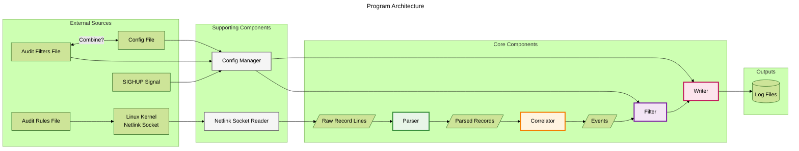

# Introduction

AuditRS is aimed at being a modern, efficient, and flexible replacement for the userspace components of the Linux audit system (auditd, ausearch, etc.). These tools allow users to monitor and analyze system activity in real-time, particularly for security and compliance purposes. AuditRS is written entirely in Rust to provide strong safety guarantees and high performance. The core functionality of AuditRS includes:

- Reading audit logs from the kernel via netlink sockets.
- Parsing raw audit record lines into structured data.
- Correlating related records into events.
- Applying user-defined filters to determine which events should be logged.
- Writing the resulting events to log files in a structured format.
- Providing a configuration system for managing audit rules, filters, and other settings.
- Seamless log rotation and management of log files.

# Goals
- **Performance**: Process audit records with minimal latency and resource usage.
- **Safety** : Leverage Rust's safety guarantees to minimize bugs and security vulnerabilities.
- **Modernization**: Provide a more user-friendly output format and configuration system, enriching the logs with additional context where possible.
- **Compatibility**: Maintain compatibility with existing audit rules, formats, and tools where possible, while also allowing for modern improvements.

# Installation
AuditRS must be made available to sudo environment for proper usage. To do so, download the binary and copy it to `/usr/bin`:
```bash
sudo cp auditrs /usr/bin
```
After this is complete, AuditRS will become available for use on the next shell reboot. Note that its functionality relies on its elevated privilege; commands must be prepended with `sudo`:
```bash
sudo auditrs start
```

# Terms and Definitions
- **Audit Record**: A structured representation of an audit event, containing fields such as timestamp, event type, user ID, etc.
- **Audit Event**: A single occurrence of an action or operation that is logged by the audit system.
  - **Simple Event** - An event that is fully contained within a single audit record.
  - **Compound Event** - An event that spans multiple audit records. Correlated via serial and timestamp.
- **Audit Rules**: Configurations applied to the kernel to specify what events are emitted.
  - These are loaded from a rules file at startup. Since it talks to the kernel, we should keep the legacy format.
  - The legacy format is quite opaque, so writing our own wrapper around it is a stretch goal.
- **Audit Filters**: User-defined criteria to determine which audit records should be logged or discarded. Applying in user-space allows for more complex logic and richer context than what the kernel can provide.
- **Configurations**: Any setting that is not a filter or rule, such as log file paths, log rotation policies, etc.

## What even is an audit record?
The Linux kernel will detect when certain events occur (e.g. a process is executed, a file is accessed, etc.) and generate audit records for those events. Each record is a line of text that contains various fields, such as the timestamp, event type, user ID, etc.

An example event looks like this:
```
type=CWD msg=audit(1768231884.582:1148): cwd="/"
type=PATH msg=audit(1768231884.582:1148): item=0 name="/etc/passwd" inode=137618356 dev=fd:00 mode=0100644 ouid=0 ogid=0 rdev=00:00 nametype=NORMAL cap_fp=0 cap_fi=0 cap_fe=0 cap_fver=0 cap_frootid=0 OUID="root" OGID="root"
type=PROCTITLE msg=audit(1768231884.582:1148): proctitle=2F7573722F6C69622F706F6C6B69742D312F706F6C6B697464002D2D6E6F2D6465627567
```
This set of records represents a single compound event where a process executed and accessed the /etc/passwd file. The first record (CWD) indicates the current working directory, the second record (PATH) provides details about the file that was accessed, and the third record (PROCTITLE) contains the command that was executed.

In the legacy audit system, these records would be logged as-is, and users would have to manually correlate them or use external tools like ausearch to make sense of them. AuditRS aims to parse and enrich this data, correlate related records into cohesive events, and provide a more user-friendly output format that includes all relevant information in a single place.

# Program flowchart ( draft! )
Below is a detailed flowchart illustrating the architecture and data flow of the audit processing system.



Notes:
- There are definitely optimizations that this flowchart does not cover, such as skipping correlation for simple events, or early filtering.
- This flowchart is probably not complete, and may be missing components. This is all I (callie!) could wrap my head around though.
